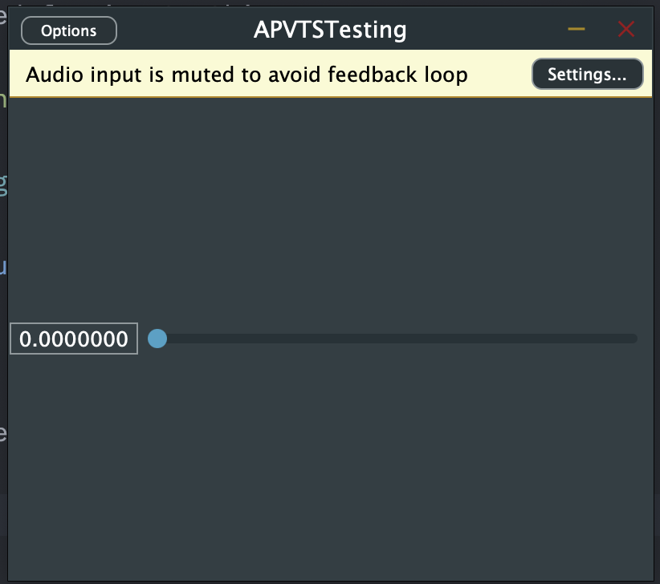

# Implementing an AudioProcessorValueTreeState
## What's an APVTS?
An APVTS (AudioProcessorValueTreeState) is a core class in JUCE that provides a powerful and flexible way to **manage parameters** for audio plugins. It acts as a central repository for all the plugin’s adjustable parameters (knobs, sliders, switches, etc.).

Additionally it automatically keeps the **GUI controls synchronized** with the underlying parameter values. When you change a knob in the GUI, APVTS updates the corresponding parameter value, and vice versa.

## Implementation
### Adding a APVTS to your plugin
Define a function, that will create the parameters, used in the audio plugin. Write this in the private section of your AudioProcessor.

**file**: `PluginProcessor.h`
```cpp
private:
    juce::AudioProcessorValueTreeState::ParameterLayout createParameterLayout();
```

Next, we need to implement the just defined function. Write this at the **bottom of the file**.
>**_Note_**: You need to **change the classname** from `AudioProcessor` to your AudioProcessor name.

**file**: `PluginProcessor.cpp`
```cpp
juce::AudioProcessorValueTreeState::ParameterLayout AudioProcessor::createParameterLayout()
{
    // defining a ParameterLayout
    juce::AudioProcessorValueTreeState::ParameterLayout layout;
    
    // create a ParameterFloat
    auto parameter = std::make_unique<juce::AudioParameterFloat>
    (
         juce::ParameterID
         {
             "param",            // identifier
             1                   // versionHint
         },
        "param",                // parameterName
         juce::NormalisableRange<float>
         (
             0.0f,               // rangeStart
             1.0f,               // rangeEnd
             0.000001f,          // intervalValue
             1.f                 // skewFactor
          ),
        0.0f                        // defaultValue
    );
    
    // add the parameter to the layout
    layout.add
    (
        std::move(parameter)
    );
    
    return layout;
}
```

Define the APVTS on the **bottom** of the public section of your PluginProcessor:

**file**: `PluginProcessor.h`
```cpp
public:
    juce::AudioProcessorValueTreeState apvts{
        *this,
        nullptr,
        "Parameters",
        createParameterLayout()
    }
```

After those steps, you now should have a working APVTS in your project.

### Linking a slider to a parameter in the APVTS
If everything works correctly, the APVTS should now be able to attach the parameters to a slider via a helper class. This can be done like the following.

First make sure, that you have a slider to use. Here we will create a own test slider. We will define this above the `JUCE_DECLARE_NON_COPYABLE_WITH_LEAK_DETECTOR (APVTSTestingAudioProcessorEditor)` but below the `APVTSTestingAudioProcessor& audioProcessor;`. We also define the slider in the private seciton of our class. 

**file**: `PluginEditor.h`
```cpp
private:
    AudioProcessor& audioProcessor; // Rename AudioProcessor with your AudioProcessor name
    
    juce::Slider slider;

    JUCE_DECLARE_NON_COPYABLE_WITH_LEAK_DETECTOR (APVTSTestingAudioProcessorEditor)
};
```

Next, we add the slider to the GUI. Here we will need to add several things in several funcitons.

In the constructor, add and make the slider visible:

**file**: `PluginEditor.h`
```cpp
AudioProcessorEditor::AudioProcessorEditor (AudioProcessor& p) // Rename AudioProcessorEditor with your AudioProcessorEditor name
    : AudioProcessorEditor (&p), audioProcessor (p)
{
    setSize (400, 300);
    
    addAndMakeVisible(slider);
}
```

change the resized funcion to this:

**file**: `PluginEditor.h`
```cpp
void APVTSTestingAudioProcessorEditor::resized()
{
    slider.setBounds(getBounds());
}
```

If we now run the program, it should display a slider:



After that, we need to attach the parameter to the slider.

We can do this via the `juce::AudioProcessorValueTreeState::SliderAttachment` helper class. We need to initialize the SliderAttachment and give it the *apvts* from the *AudioProcessor*. Next, we tell the SliderAttachment, what parameter we want to attach to. In this case, this will be the `"param"`. And lastly, we need to tell the SliderAttachment, what slider to attach the parameter to. In this case, the slider's name is just `slider`.

The private section of the header should now look as following:

**file**: `PluginEditor.h`
```cpp
private:
    APVTSTestingAudioProcessor& audioProcessor;
    juce::Slider slider;
    juce::AudioProcessorValueTreeState::SliderAttachment sliderAttachment{audioProcessor.apvts, "param", slider};
    JUCE_DECLARE_NON_COPYABLE_WITH_LEAK_DETECTOR (APVTSTestingAudioProcessorEditor)
```

If you done everything correctly, the SliderAttachment should now work and the slider now will go from 0 to 1. If you change the slider, the parameter automatically gets changed too.