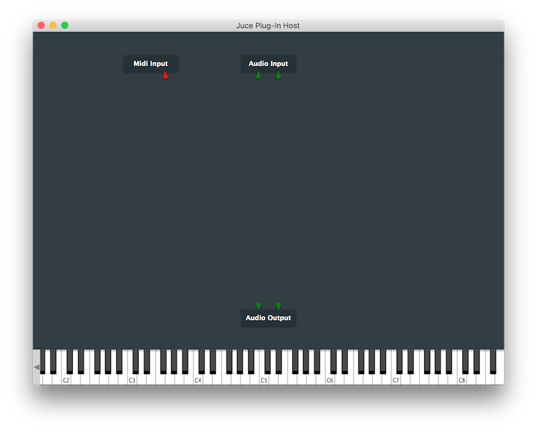
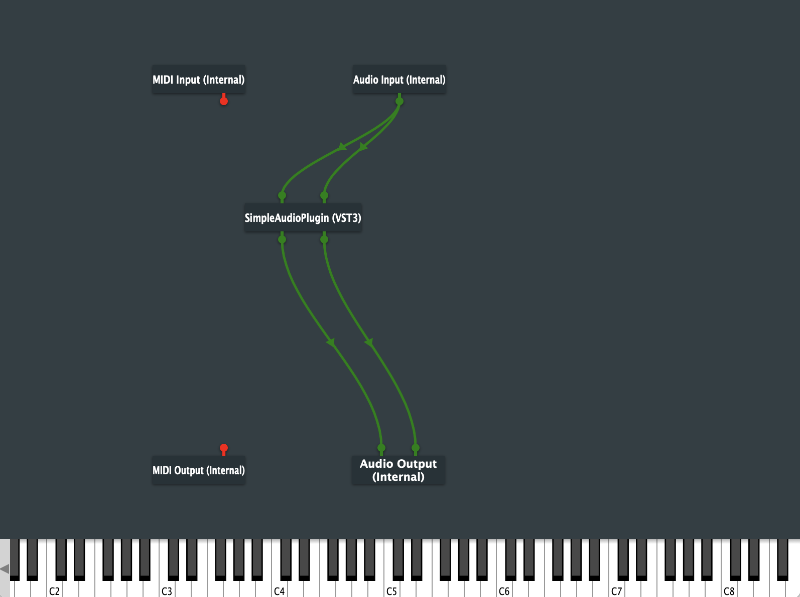

# Creating an audio plugin

## Create the project
To create an audio plug-in with JUCE, open "Projucer" and select "Plug-In>Basic". See [Creating an Application](/getting_started/installation/installation/#creating-an-application) if you don't know how to do that. In this tutorial we're going to name this plugin `SimpleAudioPlugin`.

In this tutorial, we are going to create a VST3 plug-in, so make sure, that the **VST3 setting** is ticked in the Plugin Formats field in the *project configuration* settings:

*Project configuration*

In the *project configuration* you can change and tweak much more settings. Here you can change for example the project version, the plug-in type (generator or effect), change the plug-in category (ex. distortion or delay) and much more. However we dont need to change anything besides the "plugin format".

Next click the "**Save and Open in IDE**"-button and **build it**.

## Setup debugging environment (optional)
When creating a audio plugin, accessing it fast and reliable is sometimes a hassle since DAW's sometimes have issues finding updated plugins and are very cpu intensive. Thankfully, JUCE has a simple environment to debug your application called "AudioPluginHost". This application serves as a host for your plug-ing and you can use it just like in a DAW. The "AudioPluginHost" can be started very quickly and is very easy to use, which makes it perfect for debugging.

To use the "AudioPluginHost", you first need to build it, since it doesn't come pre-compiled, like "Projucer" does. Go to `JUCE/extras/AudioPluginHost` and open the `.jucer` file. Click the "Save and Open in IDE"-button and build the project. This will create a binary file, located in one of the following folders:

| OS | Location |
| --- | --- |
| macOS  | `JUCE/extras/AudioPluginHost/Builds/MacOSX/build/...`
| Windows | `JUCE\extras\AudioPluginHost\Builds\VisualStudio2022\...`|

>Note: The application is somewhere in the subfolders of the build folder.

You can can change the location of the "AudioPluginHost" to your likings.

If you run the "AudioPluginHost", you should see the graphical node editor that looks like this:

You can search for plugins by going to **Options>Edit the List of Available Plug-ins...**. Click **Options...>Scan for new or updated VST3 plug-ins** to see the folders, that should be scanned by the "AudioPluginHost". Here you can select the folders, that are going to be scanned for new VST3 plug-ins. Here you can add or remove custom directories:

Once the scan is complete go back to the node editor and right click, then select your plug-in from the context menu (it will be under a company called "yourcompany" by default. You can edit this in the "Projucer"). Connect the nodes up such that the Audio is routed to and from the "SimpleAudioPlugin":

If you now **double click** onto the plugin node, you open the GUI of the plugin. The default does nothing but show *Hello world*.

## Automatically run AudioPluginHost
If you want to run "AudioPluginHost" automatically when building your project, you can do that via the IDE. 

In **Xcode** click `Product>Scheme>Edit Scheme...`, then under `Run>Info>Executable>Other...` search and select the "AudioPluginHost".

In **Visual Studio** go to `SimpleAudioPlugin_VST3 Debug Properties>Debugging>Command` and change it to the path to the "AudioPluginHost".