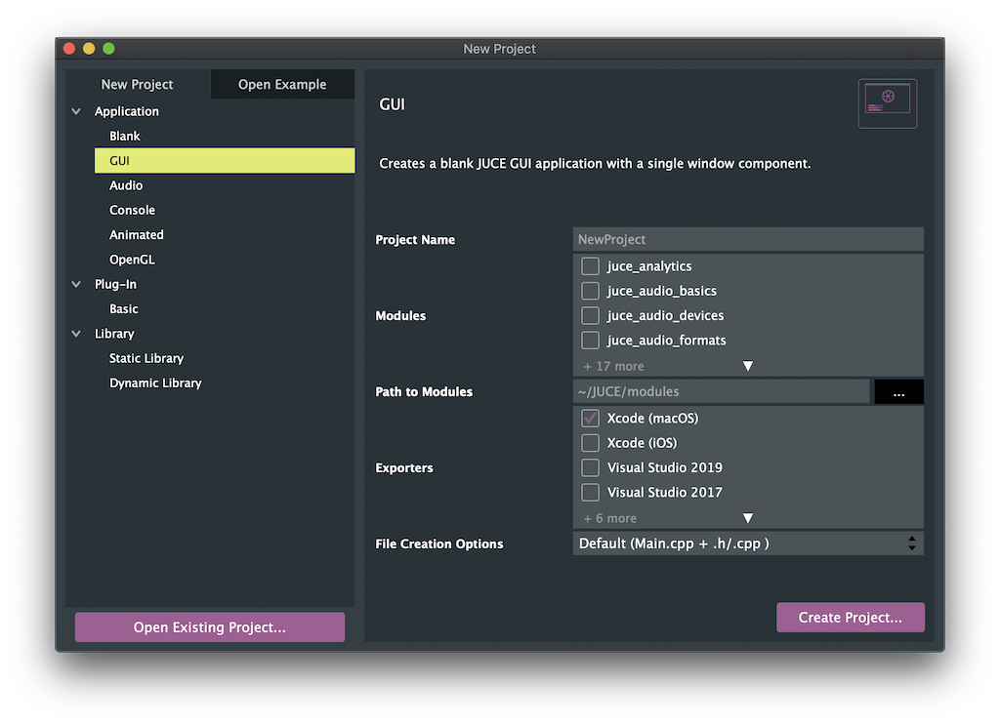

# Installation

## Installing JUCE
Before creating your first JUCE application, make sure that your local machine has either [Visual Studio](https://visualstudio.microsoft.com/) or [Xcode](https://developer.apple.com/xcode/) installed.

In addition, you need to install the C++ toolchain for the according opperating system:

**Visual Studio**: During installation, ensure that you select the "Desktop development with C++" workload.

**Xcode**: After installation, ensure that you the right components: `File>Settings>Components>macOS XX.X`

You now may download JUCE from [here](https://juce.com/download/).

Unpack the JUCE folder and place it to some location on your computer. Your user home folder is a convenient place.

Go into the JUCE folder you just moved. Launch the "Projucer", which is located in there.

>Note: You need to setup the path to JUCE and the JUCE modules. This should look something like this:
>

## Creating an Application
If you are launching "Projucer" for the first time, you are presented with the new project window. You also can access this window via `File>New Project`.

*Projucer - New Project Window*

### Select your project type
On the left-hand side of "Projucer", you can select a project type. This will add all the dependencies to create the programm selected and create code, to make the application run.

You can select from the following types:

| Project type | Description |
| --- | --- |
| Application > Blank | Creates a blank JUCE application |
| Application > GUI | Creates a blank JUCE application with a application window. |
| Application > Audio | Creates a application like "Application > GUI", but with all the setup code for audio in- and outputs. |
| Application > Console | Creates a command-line application without a GUI |
| Application > Animated | Creates a JUCE GUI application which is optimized for animations. |
| Application > OpenGL | Creates a JUCE GUI application with support for openGL drawing, like 3D model import and GLSL shaders. |
| Plug-In > Basic | Creates a basic audio plug-in. This plugin can be exported in the VST, Audio Unit and AAX formats. |
| Plug-In > ARA | Creates a plugin with ARA (Audio Random Access) support. |
| Library > Static Library | Creates a library that will be compiled into the final executable. |
| Library > Dynamic Library | Creates a library that are linked at runtime. |

Alternatively, you may start with a example project. You can open those by clicking the "Open Example" tab on the left-hand side of "Projucer".

## Create the Project
After you selected the project type, you can fill out some additional project settings on the right-hand side:
- **Project Name**: Give your application a custom Name
- **Modules**: Here you can add and remove modules, that you are going to use in your project.
- **Exporters**: Here you select which IDEs you want to use to build and debug your app.

The Projucer currently has exporters for the following IDEs:

| OS | build systems |
| --- | --- |
| macOS | Xcode |
| Windows | Visual Studio |
| Linux | Makefile |
| iOS | Xcode |
| Android | Android Studio |

>Note: If you use **Visual Studio** create a **audio plugin** and don't want to manually copy the plugin after every build, I suggest you to enable the "Plugin Copy Step":
>

## Export the project and open in IDE
After you created your project and set everything up, you can launch your IDE withing Projucer:

## Open existing projects
To open existing Projucer project's, you can either double-click the `.jucer` file in your project or click on "File>Open..." in Projucer.