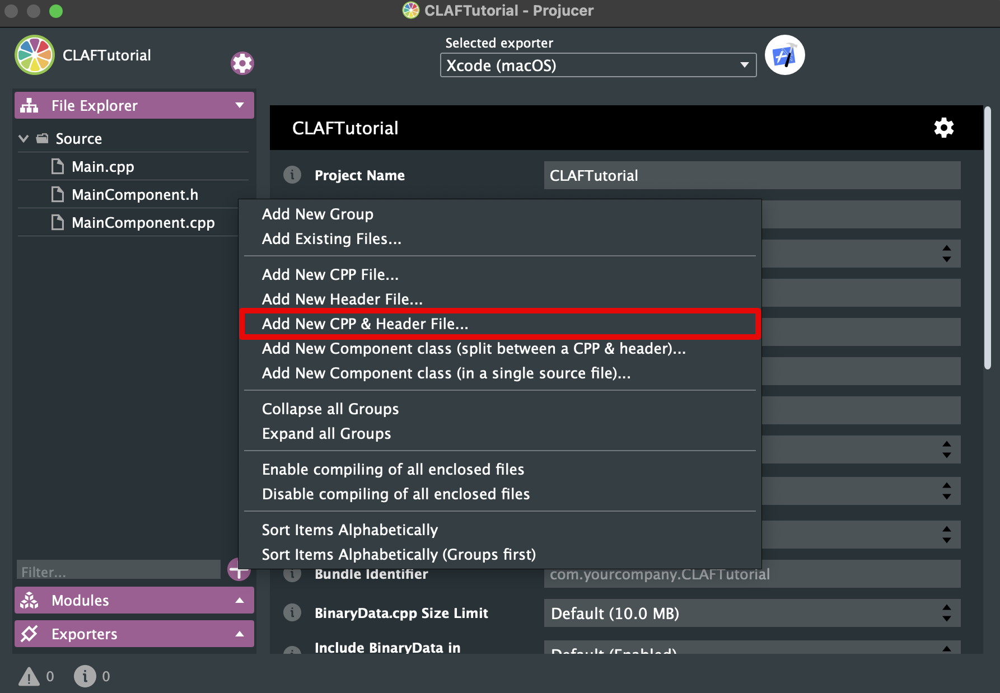

# Creating a Custom Look and Feel

## What is a LookAndFeel?

In Juce, the `LookAndFeel` class provides an abstraction layer for visual styling of your application's user interface elements. Think of it as a theme engine. It defines how components like buttons, sliders, text labels, and windows *look* – their colours, fonts, borders, shapes, and overall aesthetic.

Without a LookAndFeel, Juce would default to a basic, often unappealing, visual style. By implementing or using pre-built `LookAndFeel` classes, you can easily customize the appearance of your application to match its brand, desired feel (modern, retro, minimalist, etc.), and platform conventions.  Using a custom LookAndFeel allows for consistent styling across different platforms while still maintaining a unique identity.

## Implementation

### Creating the files

First, the required files need to be created. This is done via the [Projucer](/getting_started/what_is_juce/#projucer) application.  The [Projucer](/getting_started/what_is_juce/#projucer) will generate the necessary header and source code files for your custom LookAndFeel class.



### The Header File

Since we don't want to create everything from scratch, we inherit from an existing JUCE `LookAndFeel` class.  The recommended base class is `juce::LookAndFeel_V4`, which represents the newest and most "up-to-date" LookAndFeel provided by the Juce framework. This provides a good foundation for customization while leveraging existing functionality.

Make sure you include the JUCE header, as we need some JUCE classes. Next, we define the class.  We will override specific functions from `juce::LookAndFeel_V4` to customize its behavior.

**file**: `CustomLookAndFeel.h`

```cpp
#pragma once
#include <JuceHeader.h>
class CustomLookAndFeel : public juce::LookAndFeel_V4
{
    public:
        CustomLookAndFeel();
        void drawRotarySlider(juce::Graphics& g, int x, int y, int width, int height, float sliderPos, float rotaryStartAngle, float rotaryEndAngle, Slider& slider) override;

    private:
        JUCE_DECLARE_NON_COPYABLE_WITH_LEAK_DETECTOR(CustomLookAndFeel)
};
```

**Explanation:**

- `#pragma once`:  Ensures the header file is included only once during compilation.
- `juce::Graphics& g`: This is a reference to the graphics context used for drawing.
- `Slider& slider`: A reference to the `Slider` object being drawn.  This allows you to access its properties and potentially modify its appearance directly within the draw function.
- `JUCE_DECLARE_NON_COPYABLE_WITH_LEAK_DETECTOR(CustomLookAndFeel)`: Prevents copying of the LookAndFeel class, which is generally desirable for consistency and resource management.  The leak detector helps identify potential memory issues if you accidentally try to copy it.

### The Source File

Next, we implement the functions declared in the header file. Drawing custom UI elements requires careful calculation and drawing operations.

**file**: `CustomLookAndFeel.cpp`

```cpp
#include "CustomLookAndFeel.h"

CustomLookAndFeel::CustomLookAndFeel()
{
    setColour(juce::ResizableWindow::backgroundColourId, juce::Colours::black);
    setColour(juce::Slider::backgroundColourId, juce::Colour(36, 5, 5));
    setColour(juce::Slider::trackColourId, juce::Colour(0xFF820104));
}


void CustomLookAndFeel::drawRotarySlider (juce::Graphics& g, int x, int y, int width, int height, float sliderPosProportional, float rotaryStartAngle, float rotaryEndAngle, juce::Slider& slider)
{
    // slider properties
    slider.setTextBoxStyle(juce::Slider::NoTextBox, false, 0, 0);
    slider.setVelocityModeParameters(1.0, 1, 0.0, true, juce::ModifierKeys::shiftModifier);

    // calculate variables
    juce::Rectangle<float> bounds;
    bounds = juce::Rectangle<int>(x, y, width, height).toFloat();
    auto radius = bounds.getWidth() / 2.0f;
    auto lineWidth = 3.0f;
    auto arcRadius = radius - lineWidth / 2.0f;
    float angle = rotaryStartAngle + sliderPosProportional * (rotaryEndAngle - rotaryStartAngle);
    float centerX = x + width * 0.5f;
    float centerY = y + height * 0.5f;
    
    // draw background circle
    g.setColour(slider.findColour(juce::Slider::backgroundColourId));
    g.fillEllipse(bounds);
    
    // draw arc
    auto strokeType = juce::PathStrokeType(
            lineWidth, juce::PathStrokeType::curved, juce::PathStrokeType::rounded);
    juce::Path valueArc;
    valueArc.addCentredArc(centerX,
        centerY,
        arcRadius,
        arcRadius,
        0.0f,
        rotaryStartAngle,
        angle,
        true);
    g.setColour(slider.findColour(juce::Slider::trackColourId));
    g.strokePath(valueArc, strokeType);
}
```

**Explanation:**

- `#include <JuceHeader.h>`:  Crucially important to include the `JuceHeader` header file so that you can access the classes and methods of the JUCE framework.
- `setColour(juce::ResizableWindow::backgroundColourId, juce::Colours::black);`: Sets the background colour of resizable windows (like your main application window) to black.  `juce::Colours::black` is a convenient way to specify standard colours.
- `setColour(juce::Slider::backgroundColourId, juce::Colour(36, 5, 5));`: Sets the background colour of sliders to a very dark red. The `36, 5, 5` represents the rgb values for the color.
- `setColour(juce::Slider::trackColourId, juce::Colour(0xFF820104));`: Sets the track colour of sliders to a dark red. The `0xFF820104` represents the hexadecimal value for the color (with the alpha channel set to fully opaque).
- `drawRotarySlider`: This function is responsible for drawing the visual representation of a rotary slider.  It calculates various parameters like radius, line width, and arc angle based on the provided dimensions and slider position. It then uses `juce::Path` to create an elliptical arc representing the slider's value and draws it using `g.strokePath`. The properties of the slider are also configured here. For example, we now have shift-functionality.


## Using Your Custom LookAndFeel

To use your custom LookAndFeel in your application:

- **Include necessary header**: Include the header for your LookAndFeel class.
- **Instantiation**: Create an instance of your `CustomLookAndFeel` class.


**file**: `PluginEditor.h` or `MainComponent.h`
```cpp
#pragma once
#include <JuceHeader.h>
#include "CustomLookAndFeel.h"

class MainComponent  : public juce::Component
{
public:
    MainComponent();
    ~MainComponent() override;
    void paint (juce::Graphics&) override;
    void resized() override;

private:
    CustomLookAndFeel customLookAndFeel;
    juce::Slider slider;
    JUCE_DECLARE_NON_COPYABLE_WITH_LEAK_DETECTOR (MainComponent)
};
```

- **Setting the LookAndFeel**: Use `setLookAndFeel()` on your main component or window and a slider.
- **Delete references in destructor**: In the destructor use `setLookAndFeel(nullptr)` to avoid bugs.

**file**: `PluginEditor.cpp` or `MainComponent.cpp`
```cpp
#include "MainComponent.h"
MainComponent::MainComponent()
{
    setSize (600, 600);
    addAndMakeVisible(slider);
    setLookAndFeel(&customLookAndFeel);
    slider.setLookAndFeel(&customLookAndFeel);
    slider.setSliderStyle(juce::Slider::RotaryHorizontalVerticalDrag);
}
MainComponent::~MainComponent()
{
    setLookAndFeel(nullptr);
    slider.setLookAndFeel(nullptr);
}
void MainComponent::paint (juce::Graphics& g)
{
    g.fillAll (getLookAndFeel().findColour (juce::ResizableWindow::backgroundColourId));
}
void MainComponent::resized()
{
    slider.setBounds(getBounds());
}
```


## Further Customization & Considerations

*   **Other Components:**  You can override other drawing functions in `LookAndFeel_V4` to customize the appearance of other UI components like buttons, text labels, and knobs.  Refer to the [Juce documentation](https://juce.com/learn/documentation/) for a [complete list](https://docs.juce.com/master/classLookAndFeel__V4.html) of available overrides.
* **Color Management**: Consider using `juce::Colour` objects for all color definitions. This allows for easier manipulation and consistency across your application.
