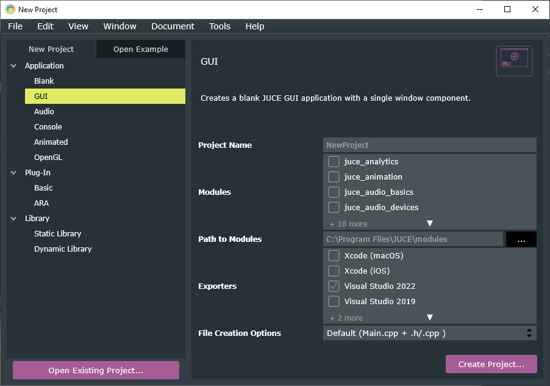
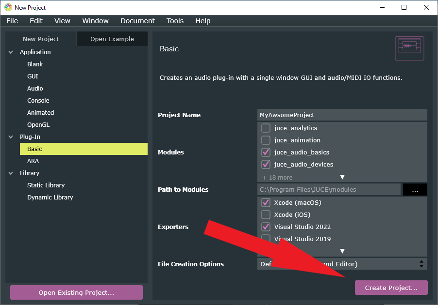
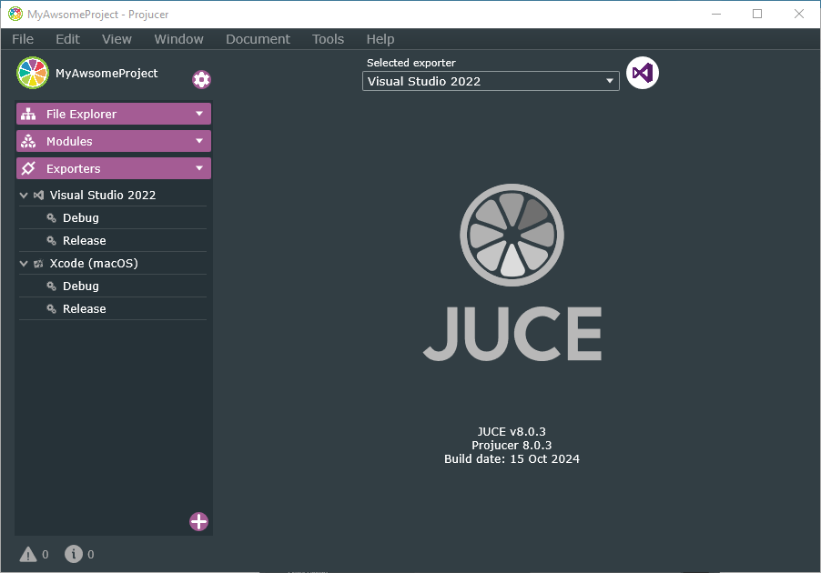
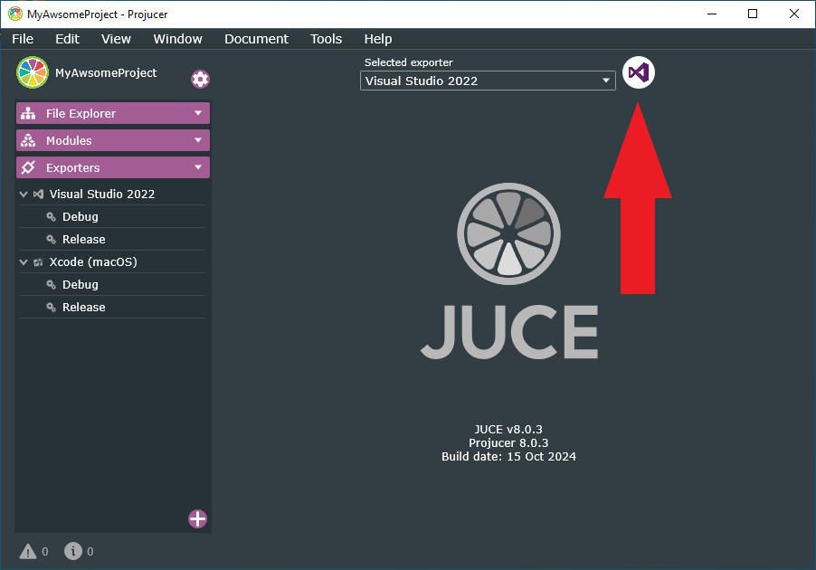

# Create a JUCE project
## Select project type
The first time you launch *Projucer*, you are presented with the *New Project* window:

Here you can select the type of the application. By default you will create a *GUI* Application. There are several different application types, that JUCE can create for you. Here is a table of the `Project type` and an according `description` (don't worry, you don't need to know this by heart since you probably only use one or two types):

| `Application>Blank`       | This creates a blank JUCE application.                                                                                                                          |
|---------------------------|------------------------------------------------------------------------------------------------------------------------------------------------------------------|
| `Application>GUI`         | This creates a minimal JUCE application with an empty application window.                                                                                       |
| `Application>Audio`       | This creates a minimal JUCE application, like `Application>GUI`, but automatically adds all the setup code that you need to easily get audio input and output. |
| `Application>Console`     | Since JUCE also offers other tools than "just" for audio, JUCE can be very helpful for developing command-line applications.                                    |
| `Application>Animated`    | This creates an application which draws an animated graphical display.                                                                                          |
| `Application>OpenGL`      | This creates a blank JUCE application with a window. This window supports OpenGL drawing features, including 3D model import and GLSL shaders.                 |
| `Plug-In>Basic`           | This creates a blank audio plug-in. All the necessary code to process audio is given and you can start fast from here.                                          |
| `Plug-In>ARA`             | This creates an ARA audio plug-in, augmenting the basic audio plug-in with ARA functionality.                                                                   |
| `Library>Static Library`  | This creates a static library. The compiled code gets linked directly into your application, making it easy to distribute everything as a single executable.    |
| `Library>Dynamic Library` | This creates a dynamic library. The compiled code remains separate and is loaded at runtime, making it ideal for plug-ins, modular tools, or code reuse.        |

Since most of the tutorials here should teach the reader more about audio plugins, we select `Plug-In>Basic`:

Next, were going to change some project properties. We want to change the *Project Name* and the *Exporters*.

## Setup the project properties
On the right-hand side, we see the Project Properties of the project, that we're creating. Here we can change the name of the project.

### Changing the Project Name

We want to change this to `MyAwsomeProject`:

### Adding an Exporter
Since we maybe want to distribute our project on macOS and on Windows, we want to have the export functionality for Visual Studio (Windows) and for Xcode (macOS). This, we want to do, because binary files on macOS wont work on Windows (yes, even if they both have the same file extension like `.vst3`).

You always can change this later on but I like to setup the project right from the start up. This just adds a few lines code in the `.jucer` file and there is almost no reason, not to do it (especially if you want to create and distribute an audio plugin).

On the right-hand side, just like the *Project Name* property, we can see the *Exporters* property:

Here we simply click the box on the left of "Xcode (macOS)":

And as a last step, we need to create the project. So just click on the "Create Project" button on the bottom right to create it:

Lastly you need to select, where the project should be stored. This can be anywhere and is your choice. After that, *Projucer* should load a bit and then you should be greeted with the *Project Window*:

Now you have a brand new JUCE project.

## Export Project in IDE
To export a project into your IDE (in this Tutorial either Visual Studio or Xcode), you can simply press the export button:

Now your IDE should open and you can start coding.

## Open existing projects
To open an existing project, you can either double-click on the .jucer file in your project folder or click on `File>Open...` in Projucer.